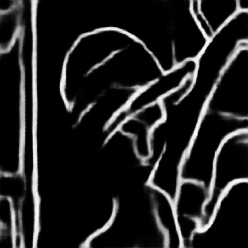

# TensorFlow Inference using C++ API

## 0) compile tensorflow C++ API from source, see ---> [Installation.md](Installation.md) 

## 1) prepare your model.pb file and see the input and output tensor name of you pb model

## 2) this software [Netron](https://github.com/lutzroeder/netron) could help you see pb model's tensor name

## 3) input ***Lenna*** image and it's result edge image   

  
   

