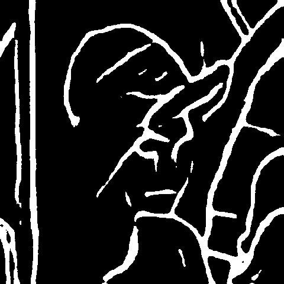

# Tensorflow Serving for Production

## **Please Note: the tensorflow (or tf-serving) version used in training model, converting model and serving client should be same.**

-------------------

## **Tutorial**
### 0. intall tf serving from source, see **Install_from_Source.md**
### 1. Prerequisites:  

Train your model with Keras or Tensorflow, for example, we pick a edge detection model to show that how to deploy your model to production using TF Serving.

* Download edge detection model file from [Here (Keras format)](https://github.com/senliuy/Keras_HED_with_model)
* Download a python script to convert the Keras format model to Tensorflow format, [Click to look: keras_to_tensorflow](https://github.com/amir-abdi/keras_to_tensorflow)
* Prerequisites:
   * Python 3.6.x   
   * Keras 2.2.4   
   * Tensorflow 1.12.0   
   * tf-serving 1.12.0   
* My develope environment:  
```   
Python 3.6.8 |Anaconda, Inc.| (default, Dec 30 2018, 01:22:34)
[GCC 7.3.0] on linux
Type "help", "copyright", "credits" or "license" for more information.
>>> import tensorflow as tf
>>> tf.__version__
'1.12.0'
>>> import keras
Using TensorFlow backend.
>>> keras.__version__
'2.2.4'
>>>
```    

**Why convert hdf5 format model to tensorflow model ? beacuse, we want to set the model input as a byte stream format image, not other format (like: cv::Mat or ndarray).**

-------------------
### 2. Convert model and set up serving:

* (1)  convert hdf5 or h5 file to pb model format file, **keras_to_tensorflow.py**

```   
python keras_to_tensorflow.py -input_model 'model.h5' -output_model 'model.pb'  -output_meta_ckpt=True 
```   

* (2) preprocess pb model with byte stream format images, **saved_model.py**

```
# Subtracts the given means from each image channel.
def mean_image_subtraction(image, means):

def preprocess_image(image_buffer):

# reconstruct graph with pb format
def load_merge_graph(frozen_graph_filename):

```

* (3) convert pb model to saved_model used in tf serving, **saved_model.py**

```
def export_savedmodel(pb_path, checkpoint_path):
```

* (4) set up your model serving, **start_serving.sh**

```
#!/bin/bash
# compiled tensorflow_model_server home path
TF_SERVING_HOME=/home/CV_Libs/tf-serving-r1.12/bazel-bin
# converted saved_model path
SERVING_MODEL_HOME=/home/tf_serving_tutorials/saved_model/

# boot your model serving
$TF_SERVING_HOME/tensorflow_serving/model_servers/tensorflow_model_server --port=18592 \
        --model_name=edge \
        --model_base_path=$SERVING_MODEL_HOME
```
* (5) test your serving using simple python client, **py_client.py**

* (6) input ***Lenna*** image and it's result edge image   

<figure class="half">
    
    
</figure>

## Some error when learning tf serving, see more in file ***Error_list.md***

-------------------
## **Reference code link**
* [holy-edge(tensorflow)](https://github.com/moabitcoin/holy-edge)
* [Keras-HED-with-model](https://github.com/senliuy/Keras_HED_with_model)
* [Keras HED for training](https://github.com/lc82111/Keras_HED)

-------------------
* [**==Deploying Object Detection Model with TensorFlow Serving — Part 1==**](https://medium.com/innovation-machine/deploying-object-detection-model-with-tensorflow-serving-7f12ee59b036)
* [**==Deploying Object Detection Model with TensorFlow Serving — Part 2==**](https://medium.com/innovation-machine/deploying-object-detection-model-with-tensorflow-serving-part-2-55e6c638822e)
* [**==Deploying Object Detection Model with TensorFlow Serving — Part 3==**](https://medium.com/innovation-machine/deploying-object-detection-model-with-tensorflow-serving-part-3-6a3d59c1e7c0)
* [Official: Tensorflow Object Detection API](https://github.com/tensorflow/models/tree/master/research/object_detection)
* [Official: tf serving examples](https://github.com/tensorflow/serving/tree/master/tensorflow_serving/example)
* [TensorFlow Custom Op](https://github.com/tensorflow/custom-op)
* [『TensorFlow』模型保存和载入方法汇总](https://www.cnblogs.com/hellcat/p/6925757.html)
* [tensorflow-serving-client,Python](https://github.com/triagemd/tensorflow-serving-client)
* [tensorflow-object-detection-cpp](https://github.com/lysukhin/tensorflow-object-detection-cpp)
* [**Great: Deep-Learning-in-Production**](https://github.com/ahkarami/Deep-Learning-in-Production)
* [**==How-to-Deploy-a-Tensorflow-Model-in-Production==**](https://github.com/llSourcell/How-to-Deploy-a-Tensorflow-Model-in-Production)
* [How to deploy TensorFlow models to production using TF Serving](https://www.freecodecamp.org/news/how-to-deploy-tensorflow-models-to-production-using-tf-serving-4b4b78d41700/)
* [Run TensorFlow models in C++ without installation and without Bazel](https://github.com/serizba/cppflow)
* [知乎 - 笔记 - TensorFlow模型的跨平台部署（二）](https://zhuanlan.zhihu.com/p/40226973)
* [**~~Tensorflow的三种储存格式-2（pb & Saved Model）~~**](https://zhuanlan.zhihu.com/p/60069860)
* [How to deploy TensorFlow models to production using TF Serving](https://sthalles.github.io/serving_tensorflow_models/)
* [==Image Classification - Exporting models, Inference and Bonus Classifiers==](https://miramar.io/ep1/s1e3.html)
* [==TensorFlow: How to freeze a model and serve it with a python API==](https://blog.metaflow.fr/tensorflow-how-to-freeze-a-model-and-serve-it-with-a-python-api-d4f3596b3adc)    
* [Youtube Video: How to Export a Tensorflow saved model for object detection classifier](https://www.youtube.com/watch?v=w0Ebsbz7HYA) ---> [Code: export-code ](https://app.nihaocloud.com/d/90fde4c6afb9444cb068/)
 * [Youtube Video: 如何将Tensorflow模型部署到生产环境中](https://www.youtube.com/watch?v=T_afaArR0E8)
  
-------------------
* [==Model Speed (ms): Tensorflow detection model zoo==](https://github.com/tensorflow/models/blob/master/research/object_detection/g3doc/detection_model_zoo.md)
* [Step by Step TensorFlow Object Detection API Tutorial — Part 1: Selecting a Model](https://medium.com/@WuStangDan/step-by-step-tensorflow-object-detection-api-tutorial-part-1-selecting-a-model-a02b6aabe39e)
* [Step by Step TensorFlow Object Detection API Tutorial — Part 2: Converting Existing Dataset to TFRecord](https://medium.com/@WuStangDan/step-by-step-tensorflow-object-detection-api-tutorial-part-2-converting-dataset-to-tfrecord-47f24be9248d)
* [Step by Step TensorFlow Object Detection API Tutorial — Part 3: Creating Your Own Dataset](https://medium.com/@WuStangDan/step-by-step-tensorflow-object-detection-api-tutorial-part-3-creating-your-own-dataset-6369a4d30dfd)
* [Step by Step TensorFlow Object Detection API Tutorial — Part 4: Training the Model](https://medium.com/@WuStangDan/step-by-step-tensorflow-object-detection-api-tutorial-part-4-training-the-model-68a9e5d5a333)
* [Step by Step TensorFlow Object Detection API Tutorial — Part 5: Saving and Deploying a Model](https://medium.com/@WuStangDan/step-by-step-tensorflow-object-detection-api-tutorial-part-5-saving-and-deploying-a-model-8d51f56dbcf1)

-------------------
## **TensorFlow version**
### Linux, [Tested build configurations](https://tensorflow.google.cn/install/source)
Version	|Python version	|Compiler	|Build tools	|cuDNN	|CUDA  
---|---|---|---|---|---|---|--- 
tensorflow-2.0.0|	2.7, 3.3-3.7	|GCC 7.3.1	|Bazel 0.26.1	|7.4	|10.0  
tensorflow_gpu-1.14.0|	2.7, 3.3-3.7	|GCC 4.8	|Bazel 0.24.1	|7.4	|10.0  
tensorflow_gpu-1.13.1|	2.7, 3.3-3.7	|GCC 4.8	|Bazel 0.19.2	|7.4	|10.0  
tensorflow_gpu-1.12.0|	2.7, 3.3-3.6	|GCC 4.8	|Bazel 0.15.0	|7	|9  
tensorflow_gpu-1.11.0|	2.7, 3.3-3.6	|GCC 4.8	|Bazel 0.15.0	|7	|9  
tensorflow_gpu-1.10.0|	2.7, 3.3-3.6	|GCC 4.8	|Bazel 0.15.0	|7	|9  
tensorflow_gpu-1.9.0|	2.7, 3.3-3.6	|GCC 4.8	|Bazel 0.11.0	|7	|9  
tensorflow_gpu-1.8.0|	2.7, 3.3-3.6	|GCC 4.8	|Bazel 0.10.0	|7	|9  
tensorflow_gpu-1.7.0|	2.7, 3.3-3.6	|GCC 4.8	|Bazel 0.9.0	|7	|9  
tensorflow_gpu-1.6.0|	2.7, 3.3-3.6	|GCC 4.8	|Bazel 0.9.0	|7	|9  
tensorflow_gpu-1.5.0|	2.7, 3.3-3.6	|GCC 4.8	|Bazel 0.8.0	|7	|9  
tensorflow_gpu-1.4.0|	2.7, 3.3-3.6	|GCC 4.8	|Bazel 0.5.4	|6	|8  
tensorflow_gpu-1.3.0|	2.7, 3.3-3.6	|GCC 4.8	|Bazel 0.4.5	|6	|8  
tensorflow_gpu-1.2.0|	2.7, 3.3-3.6	|GCC 4.8	|Bazel 0.4.5	|5.1	|8  
tensorflow_gpu-1.1.0|	2.7, 3.3-3.6	|GCC 4.8	|Bazel 0.4.2	|5.1	|8  
tensorflow_gpu-1.0.0|	2.7, 3.3-3.6	|GCC 4.8	|Bazel 0.4.2	|5.1	|8  